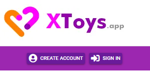
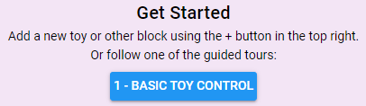

# First Steps

Before connecting your sex toys and using XToys there's a few things you may want to do first.

## Sign Up

Under the left side slideout menu click the **Create Account** button and create your XToys account.

## Download the App

If using XToys on mobile you can download the Android or iOS app. In general the apps function much better than just using the site in your web browser (increased toy compatibility and handling of toy connectivity while the screen is off, some tools only work with the app and not the website, etc).

### Android

To install the Android app click the **Android Full Version** button on the XToys homepage or click [here](https://xtoys.app/XToys.apk) to directly download the APK.

::: danger Android Compatibility
Note that the app only works on Android Oreo (8.0) or later.
:::

To install the Android app:

1. Enable App Installations from Unknown Sources (ie. allow apps to be installed from outside of the Play Store). To do so search your Android Settings for 'unknown sources'.
2. Download the APK, open it, and then click Install.

::: tip XToys Lite
There is a version of XToys in the Play Store called XToys Lite. However it only supports online play, toy connectivity, and patterns. It does not support any tools, scripts, or teases. We highly recommend using the full version of XToys.
:::

### iOS

iOS unfortunately does not easily support installing apps from outside of the App Store. There are two options to install XToys on your iPhone.

#### On a Jailbroken iPhone
If you have a jailbroken iPhone install the XToys.ipa file by using AppSync Unified (available via Cydia).

#### On a Non Jailbroken iPhone
If you do not have a jailbroken iPhone using AltStore to install the XToys.ipa file:

1. Download and install AltServer onto your macOS or Windows computer.
2. Connect your phone, launch AltServer, and select Install AltStore.
3. Open AltStore on your phone, go to My Apps, click the + button, and select the XToys.ipa file.

::: tip
Note that AltServer must be left running on your computer and your phone will use it to automatically re-sign the XToys app with a valid Apple certificate once a week to keep it running on your phone.
:::

## Guided Tour
To get a quick overview of basic controls try clicking the **Basic Toy Controls** button on the XToys homepage. It will click through the basic functionality and explain things as it goes.

