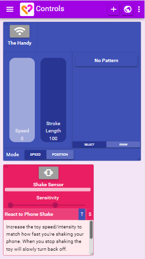
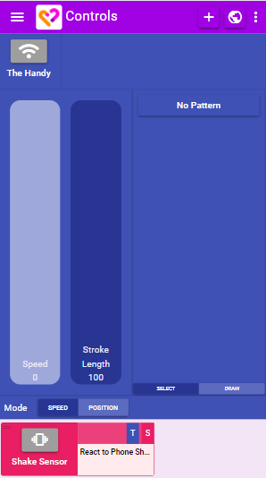

# Layout Basics

## Dashboard vs Basic Layout

XToys has two different layout modes:

* **Basic** - A single block takes up the majority of the screen and other blocks are minimized at the bottom.
* **Dashboard** - Each block is displayed in a grid and can be freely dragged around and re-sized.

By default Desktop mode is used on a PC, and Basic mode is used on a phone.

There are two ways of switching between layouts:

* In the left sidebar select either Dashboard or Basic
* Click the XToys logo in the toolbar

## Dashboard Mode

* The small top left horizontal bars on each block allow you to drag the controls around
* The small bottom right resize on each block allows you to resize the controls (if you're in Dashboard mode)

By default blocks are automatically moved to fill any empty space. To disable this functionality go to the 3 dots and select **Free Layout**.

## Basic Mode

* Click the label on any minimized block and select **Show** to display it maximized in a pop-up window. Clicking in any empty space in the block will also maximize it.
* Click the label on any minimized block and select **Set as Primary Block** to make it the new main block.
* Click the label of the primary block and select **Toggle Fullscreen** to make it take up the entire screen (hiding minimized blocks + the top toolbar).

By default the first toy you add will be the primary block. Scripts and Tools will always be minimized by default.

## Saving Layouts

Your current layout (ie. all blocks you've added, their position, and any settings you've set) can be saved so that you can easily restore everything to the same state.

To do so click the three dots and select **Save Layout**. To later restore the layout select **Layouts** from the sidebar and locate your saved layout.