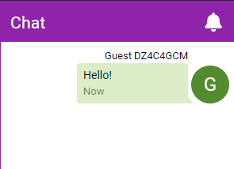

# Online Play

## Starting a Session

Add any toys and other blocks you want in your session and then click the **globe** button and select **Host Session**.

::: warning Limitations
* Teases are not usable in an online session.
* Guests cannot add any blocks themselves. If you want guests to connect their toys make sure you've added their toys to the session.
:::

You will now be presented with a number of configuration options for your session (see [Session Settings](./online-play.md#Session-Settings) below for info). Configure them as desired.

Once you've decided on your settings click **Host Session**. Your online session is now active and you'll be presented with your session code and additional controls.

Share the session code or direct link with people you want to play with. You can also click the QR code button to get a QR code.

## Joining a Session

To join a session you can either:

* Click the link you were given (a link in the format of *https://xtoys.app/session/{sessioncode}*)
* Scan the QR code
* Click the **globe** in the top toolbar, select **Join Session**, and then enter the code you were given

After connecting you may be prompted with information the host would like you to read before playing, and you may need to wait for the host to accept your request to join.

You can then connect your toys or use any controls as usual. Any changes will be synced with everyone connected to the session (ie. if you change a slider everyone will see it change and everyone's toys connected to that block will react).

## Session Settings

Before starting a session there are a number of options you can configure.

* **Session Info** - Enter any info you'd like to display to guests when they connect your session. Optional.
* **Visibility** - Determine's whether your session gets publicly listed at [https://xtoys.app/sessions](https://xtoys.app/sessions)
* **Password Protect** - Allows you to set a password that guests must enter to connect to your session
* **Custom Session Code** - Allows you to create a unique reusable code for your session (requires a Premium membership)
* **Allow Chat** - Will show a chat bar on the right side of your session where you and guests can send chat messages
* **Guest Control** - Allows guests to control any toys/scripts that are in your session
* **Manually Approve Guests** - Prevents guests from connecting to your session until you manually approve them. You will get prompted to approve guests when they try and connect. This will also allow you to kick out guests.

::: tip Toy Connectivity
Note that anyone in the session can connect their toys if a relevant toy block is available. Multiple people can also connect to the same toy block at the same time and thus all be controlled from the same slider.
:::

## Session Controls

While a session is active you can adjust a number of settings.

* **Connections** - From here you can see who is connected to your session, grant them access to the session, remove them from the session, and toggle who is allowed to control the toys.
* **Per Block Permissions** - From here you can limit who in the session can see or control things at a per block level.

## Dashboard Changes

When a session is active there will be a few changes to the main screen.

* The globe will be green while the session is active and the number of connected guests will be shown in brackets
* A chat button will be available in the toolbar
* If guests have connected their toys the toy connect button will be blue and the number of guests with their toy connected will be shown in brackets

By default any chat messages will trigger an alert on your phone or a popup in XToys in the browser. To disable this open the chat sidebar and click the notification button.

