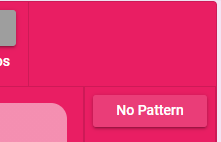

# Using Patterns

## Pattern Info

When browsing patterns you will be presented with multiple details about each pattern.

On the right you'll find:
* The rating others have given the pattern. Click the stars to add your own rating.
* A count of how many people have used the pattern.
* The length of the pattern if applicable.
* The type of pattern.
* The pattern compatibility. The pattern will only be usable with a toy if the toy matches one of the compatibility types.

::: tip Pattern Types
**Basic** - A pattern comprised of different basic wave forms.  
**Scripted** - A pattern that will generally includes controls for dynamically modifying the pattern in some way. Scripted patterns do not have a pattern length as they run forever and are often randomized.  
**Audio** - A pattern built from an audio file. Audio patterns will play the audio file itself when used with an audio e-stim device. For other toys they'll play a simplified interpretation of the audio.  
**Drawn** - A pattern created by drawing with your mouse/finger.  
**Funscript** - A pattern created from a Funscript file, which is a simple sex toy pattern format generally used for positional control of stroking toys.
:::

::: tip Compatibility
Any pattern can be made compatible with any toy. The compatibility selection is designed just to limit patterns from showing up on toys that wouldn't make sense (ex. a very fast changing pattern designed for e-stim shouldn't show up for a slow inflating toy like the Lovense Max).

If you want a pattern to be usable with your toy you can edit the pattern and adust the Compatibility section to include your toy type. The **Generic** option will make the pattern compatible with all toys.
:::

## Finding Patterns

Navigate to the [Browse Public Patterns](https://xtoys.app/patterns) entry in the sidebar.

Locate a pattern you want, select it, and click **Save to My Patterns**. It will now be saved in your list of Patterns and you can edit your saved copy as desired.

## Playing a Pattern

Once you've picked some patterns you want and saved them, return to your toy controls and click the pattern selection button.

You will be presented with all the patterns you've saved that work with your toy. Click the pattern you want.

* The dice button in the top bar will select a random pattern
* There are filters to search for the specific pattern you want
* The **Public Patterns** button will let you select any public pattern that works with your toy even if you haven't saved them to My Patterns

## Controlling Your Pattern

As soon as you select a pattern it will begin playing on your toy. Pattern intensity is controlled by the toy intensity slider, so remember to increase it.

If the pattern you selected has dynamic controls they will be presented and you can use them to adjust how the pattern plays.

## Drawing a Pattern

If you want to impromptu make a quick pattern click the **Draw** button on the toy controls. You can then drag the circles around to draw a pattern which will repeat until you stop the pattern or draw something else.

