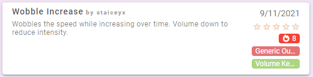
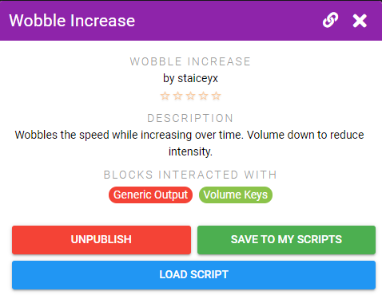
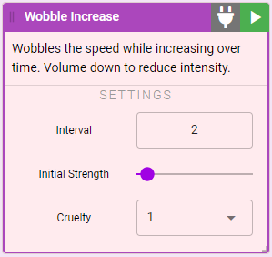
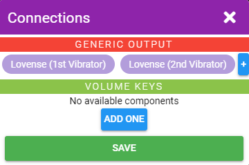

# Using Scripts

Scripts allow you to automate changes to the intensity and patterns your toys are playing. They are also used to control how tools behave.

## Script Info

When browsing scripts you will be presented with multiple details about each script.

On the right you'll find:

* The rating others have given the script. Click the stars to add your own rating.
* A count of how many people have used the script.
* The types of toys and tools that this script interacts with/can connect to.

## Finding Scripts

Navigate to the [Browse Public Scripts](https://xtoys.app/scripts) entry in the sidebar.

Locate a script you want, select it, and click **Save to My Scripts**. It will now be saved in your list of Scripts and you can edit your saved copy as desired.

## Using a Script

To add a script navigate to **My Scripts** or **Public Scripts**, select the script you want and click the **Load Script** button.

::: tip Embedding Scripts
If you've selected a script that only connects to 1 tool you'll be prompted on whether you want to embed the script in the tool. This will cause the script will auto-start/stop when you connect/disconnect the tool. Alternatively you can choose to not embed the script and then you can start/stop the script manually.
:::

The script will now be shown in your session.

* The plug button is used to connect your script to the other blocks it interacts with
* The play button starts the script
* Settings can be adjusted at any time and the script will immediately start using the new values

Click the plug button and you'll be presented with a list of blocks you can connect. If you don't have that type of block in your session you can directly add it from this dialog.

::: tip Multiple Connections
Some connections like toy output can be connected to multiple toys at once. For example in the above screenshot the Wobble Increase script can be connected to both vibrators.
:::