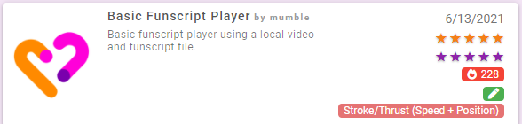
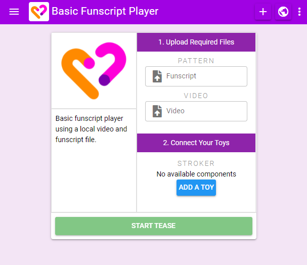
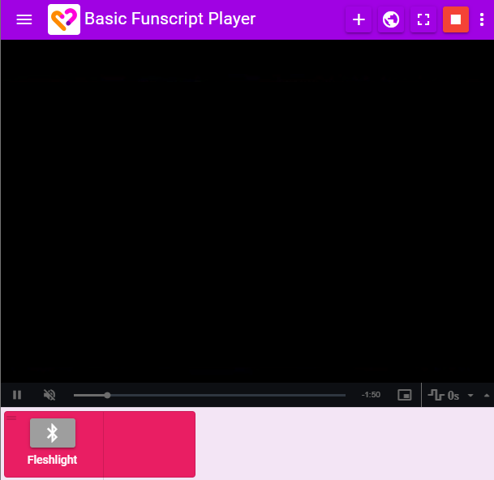

# Using Teases

Teases are very similar to scripts. However unlike scripts which are largely meant to just be started in the background, teases are meant to be the main thing you're interacting with while a tease is active.

Teases display text, audio, video, and choices to you while they run and are designed to be watched while your toys react. This includes things like syncing your toys to a porn video, visual novel/interactive stories, or listening to hypnosis and repeating commands.

## Tease Info

When browsing teases you will be presented with multiple details about each tease.

On the right you'll find:

* The rating others have given the tease. Click the stars to add your own rating.
* A count of how many people have used the tease.
* The types of toys and tools that this tease interacts with/can connect to.

## Using a Tease

To add a tease navigate to **My Teases** or **Public Teases**, select the tease you want and click the **Load Tease** button.

The tease will now be shown in your session.

Before starting the tease you will see the tease setup screen:

* The tease name will be shown in the top bar
* The three dots menu includes options for removing the tease
* If any files from your computer are needed you'll be prompted to upload them (ex. local audio/video files or funscripts)
* Connect the tease to any other toys/other blocks it interacts with
* Click **Start Tease** to start

When a Tease is running:

* Any text/audio/video/timers/choices will be shown on screen
* A stop button will be displayed in the top menu bar
* A fullscreen button will be displayed in the top menu bar