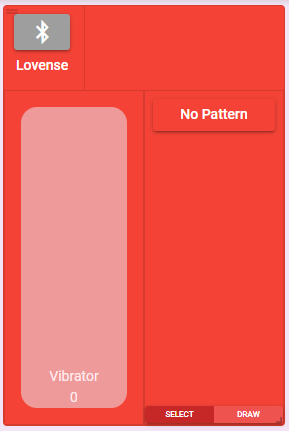
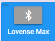

# Add and Connect a Toy

## Add a Toy

To add a toy click the + button in the top right.

From here a list of all the toys that are compatible with XToys will be displayed. Select the picture of your toy and then click the **Add to Session** button.

::: tip
All toys within the same card are identical and thus it doesn't matter which toy within the card you select. You can also simply click the title of the card without selecting a specific toy.
:::

## Toy Controls Interface

The controls for your toy should now be visible.

* The small top left horizontal bars allow you to drag the controls around (if you're in Dashboard mode)
* The small bottom right resize allows you to resize the controls (if you're in Dashboard mode)
* Click the large top left button (with the Bluetooth symbol in this case) to connect your toy
* Click the name of your toy to edit your toys settings or remove the toy
* The top right area shows a graph of the past few seconds of the pattern your toy was playing
* Drag the left side slider to adjust the intensity of your toy. You can also click in the top half to increase by one or click in the bottom half to decrease by one.
* Click the right side **No Pattern** button to change which pattern your toy is playing.
* When a pattern is active there may also be controls on the right side for adjusting different parameters of the active pattern.
* Click the **Draw** button to change to a drawing mode where you can use your mouse to draw a pattern which your toy will then repeat until you stop it.

::: tip
Any pattern you select is scaled to the intensity you've set with the intensity slider. Therefore to play a pattern you must also increase the intensity slider to the amount you want or the toy won't do anything.
:::

## Toy Settings

By clicking the toy name and selecting **Edit** you can access additional settings for your toy.

* Change the display name of your toy
* Change the maximum intensity of your toy. This will prevent anyone including anyone remotely controlling your toy from setting it to a higher intensity than you've set here.
* **Show Maximum Intensity Controls** will display an additional set of sliders in your toy controls that will let you (and only you) more easily adjust the maximum intensity of your toy. This can be useful for toys where you may want to adjust the maximum intensity fairly often (like adjusting the max strength for e-stim toys as you get used to the intensity).
* **Per Channel** pattern controls can be selected for toys with multiple channels (ex. 2 vibrators) so that you can select separate patterns for each channel.
* The color selector lets you change the color of the controls

## Connect your Toy

Click the large button in the top left of the toy controls to connect your toy. Depending on which toy you're using you may get prompted with additional dialogs to select how to connect your toy.

::: tip Button Color
The button will change color depending on the state of your toy:
* **Grey** - Not connected
* **Green** - Connected
* **Orange** - Connection temporarily lost. Attempting to reconnect.
* **Blue** - Toy is connected but not from the device you're using (ex. you're in an online session and someone else has connected a toy)
:::