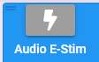
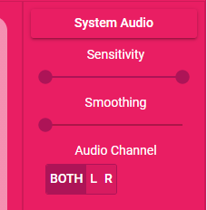

# Basic Functionality

## Basic On-Screen Toy Controls
<Badge text="Chrome" vertical="middle" />
<Badge text="Chrome on Android" vertical="middle" />
<Badge text="Android" vertical="middle" />
<Badge text="iOS" vertical="middle" />

The basic set of controls for most toys in XToys.

For more details see the [Toy Controls Interface](/getting-started/using-toys.html#toy-controls-interface) section.

## Floating Controls
<Badge text="Chrome" vertical="middle" type="danger" />
<Badge text="Chrome on Android" vertical="middle" type="danger" />
<Badge text="Android" vertical="middle" />
<Badge text="iOS" vertical="middle" type="danger" />

Control your toys with small floating controls while using other apps on your phone. To launch the floating controls tap the popout button located in the top right corner of a Toy Block.

::: tip Controls
* Use the sliders to adjust the toy intensity
* Tap the toy name to collapse the controls
* Drag the controls to the bottom of the screen to close them
:::

An XToys Premium membership is required to use this feature.

## Remote Sessions
<Badge text="Chrome" vertical="middle" />
<Badge text="Chrome on Android" vertical="middle" />
<Badge text="Android" vertical="middle" />
<Badge text="iOS" vertical="middle" />

## Bluetooth Toys
<Badge text="Chrome *" vertical="middle" />
<Badge text="Chrome on Android" vertical="middle" />
<Badge text="Android" vertical="middle" />
<Badge text="iOS" vertical="middle" />

* Satisfyer toys, Vibease toys, and the Chorus, Vector, Moxie, and Wand toys from We-Vibe have issues connecting in Windows and thus only work in the Android/iOS app

The vast majority of toys that work with XToys are connected to using Bluetooth.

To connect to your toy click the large bluetooth button and then select your toy from the list of discovered bluetooth devices.

For best results using an external bluetooth USB dongle instead of the bluetooth built in to your PC, and use a USB 4.0 dongle instead of USB 5.0. We recommend this [CSR 4.0 USB Bluetooth Dongle](https://www.amazon.com/Onvian-Bluetooth-Receiver-Transfer-Wireless/dp/B07G9TSDCG?&linkCode=ll1&tag=xtoys0ee-20&linkId=903a5fb19435c269a80cccc17f8bc1e1&language=en_US&ref_=as_li_ss_tl").

::: tip Lovense specific notes
* The Lovense USB Bluetooth Adapter is not a standard bluetooth dongle and will not work with non Lovense toys
* Lovense toys will connect with a standard bluetooth dongle and the Lovense specific one is not required
:::

## Wi-Fi Toys
<Badge text="Chrome" vertical="middle" />
<Badge text="Chrome on Android" vertical="middle" />
<Badge text="Android" vertical="middle" />
<Badge text="iOS" vertical="middle" />

Some toys like The Handy have the ability to connect via Wi-Fi. To use this functionality follow the vendors instructions for setting up the toy for Wi-Fi connectivity and then in XToys click the large Wi-Fi button and follow the instructions to connect to your toy.

## Serial Port Toys
<Badge text="Chrome" vertical="middle" />
<Badge text="Chrome on Android" vertical="middle" type="danger" />
<Badge text="Android" vertical="middle" type="danger" />
<Badge text="iOS" vertical="middle" type="danger" />

Some toys have the ability to connect via Serial Port. To use these toys plug them in to your computer, in XToys click the large Serial connect button and then select your toy from the list of discovered Serial port devices.

## E-Stim Audio
<Badge text="Chrome" vertical="middle" />
<Badge text="Chrome on Android" vertical="middle" />
<Badge text="Android" vertical="middle" />
<Badge text="iOS *" vertical="middle" />

* Only while app is visible.

Some toys like e-stim units are controlled via the audio port on your computer. To use these toys connect your toy using a [3.5mm to 3.5mm Male-Male audio cable](https://amzn.to/3E1MIeG), and then click the large audio connect button in XToys.

For best results set your system audio to around 50% and then under the toy menu select **Adjust Volume Range**. From here you can tell XToys at what volume level you start feeling a sensation on the e-stim unit, and at what volume level the e-stim unit is sending a maximum intensity signal. XToys will then scale the audio output to smoothly fall within this range.

## System Audio Detection
<Badge text="Chrome *" vertical="middle" />
<Badge text="Chrome on Android" vertical="middle" type="danger" />
<Badge text="Android **" vertical="middle" />
<Badge text="iOS" vertical="middle" type="danger" />

* Only on Windows. 
** Does not work for all apps.

Your toys can react in time with any playing audio from your music player, video game, or other audio source on your PC or phone.

To use the System Audio click the Pattern Select button and select System Audio from the list of patterns.

After this XToys may prompt you to install a helper application on Windows, or to grant XToys permission in the Android app to monitor audio.

While the System Audio is playing you can drag the Sensitivity and Smoothing sliders to adjust how XToys interprets the playing audio. Setting the sensitivity to for example 0-50% will cause 50% audio volume to be interpreted as max intensity.

Android apps are able to prevent XToys from monitoring the audio, which means that some games and major web browsers may not work. If you need an Android web browser that works with the System Audio feature try the [DuckDuckGo browser](https://discord.com/channels/768479834442563654/776166982902743040/845753154968354817).

## Custom Toys
<Badge text="Chrome" vertical="middle" />
<Badge text="Chrome on Android" vertical="middle" type="danger" />
<Badge text="Android" vertical="middle" type="danger" />
<Badge text="iOS" vertical="middle" type="danger" />

If you're a hardware developer and are making your own custom toys you can connect to them with XToys. XToys currently only supports connecting custom toys via a serial port and only supports a fixed JSON format for sending messages to the toys.

To add a custom toy go to the [Custom Toys](https://xtoys.app/me/custom-toys) page and click the + button. Enter a Name, select the type of toy, the Baud rate, and view the sample messages and sample Arduino Code that is displayed in the dialog. Update the code your device is running to handle the messages.

After saving your toy select it from the main Add a Block selector just like with any other toy.

