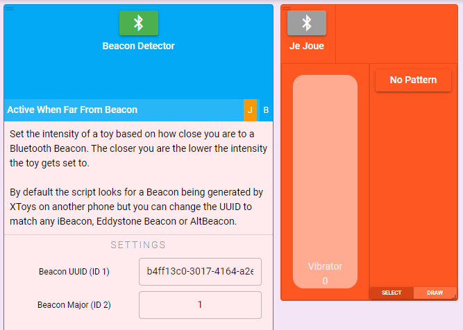
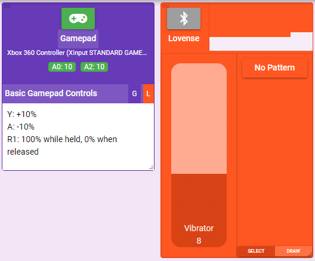
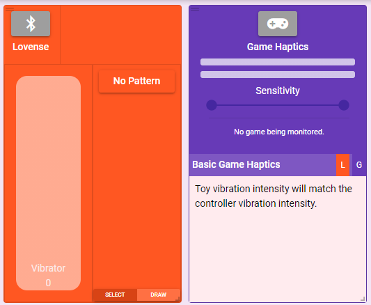
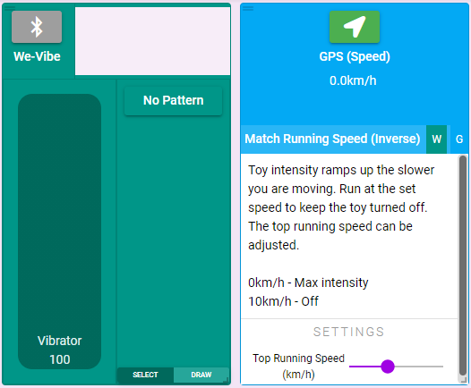
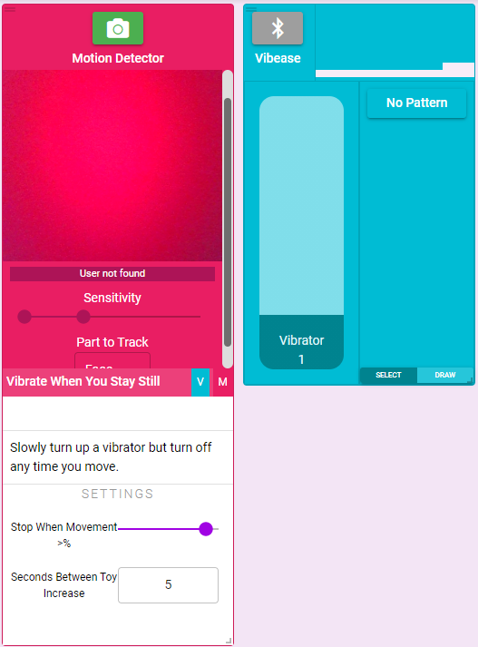
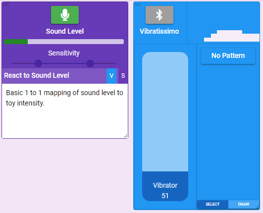
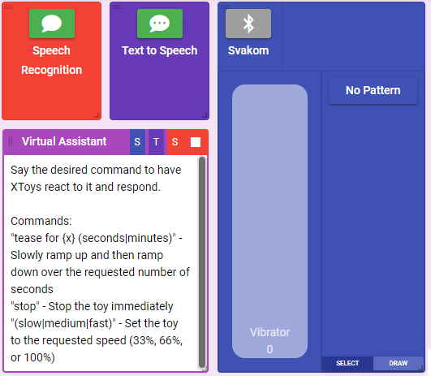
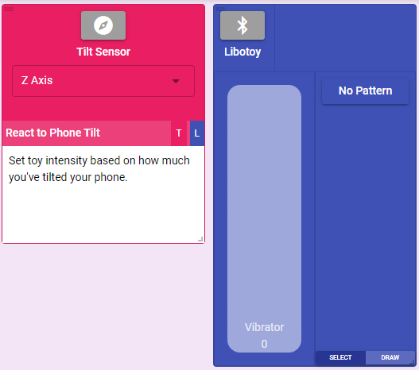
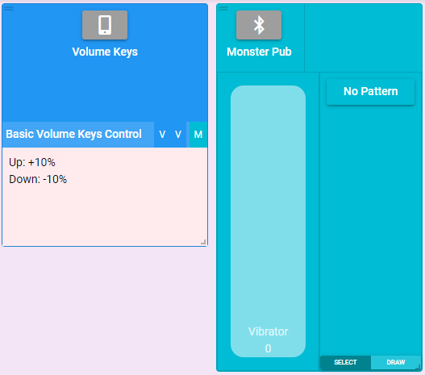

# Tools

XToys has a variety of 'Tools' that allow it to connect to other inputs and outputs on your PC or phone. Tools need an associated script to be connected which then controls how your toy reacts to events.

## Beacon
<Badge text="Chrome" vertical="middle" type="danger" />
<Badge text="Chrome on Android" vertical="middle" type="danger" />
<Badge text="Android" vertical="middle" />
<Badge text="iOS" vertical="middle" type="danger" />

XToys can broadcast a Bluetooth beacon that other phones running XToys can use to detect how close two phones are. This can be used for things like changing the toy intensity based on proximity between two people.

Instead of using XToys to broadcast the Beacon you can also use any other Bluetooth Beacon app on your phone, or even physical Bluetooth Beacons.

XToys Beacons use the UUID: b4ff13c0-3017-4164-a2ee-7da1ecb109d6

## Beacon Detector
<Badge text="Chrome" vertical="middle" />
<Badge text="Chrome on Android" vertical="middle" />
<Badge text="Android" vertical="middle" />
<Badge text="iOS" vertical="middle" />

XToys can look for and react to your phones proximity to a Bluetooth Beacon.

::: details Usage Steps

1. Enable a remote Bluetooth Beacon (ex. launch XToys on a separate phone and add and start a Beacon).
2. Add a Beacon Detector block, select a relevant script when prompted (ex. [Active When Far From Beacon](https://xtoys.app/scripts/-MQ3mbzQmz3Owj2G4g_g) to have the toy turn on if you go too far away from your partner), and connect the script to your toy.
3. Enter your Bluetooth Beacon details in the script if they're different than the default.
4. Turn on the Beacon Detector.
5. Walk closer or further from your Beacon and confirm your toy changes intensity.
:::

## Gamepads
<Badge text="Chrome *" vertical="middle" />
<Badge text="Chrome on Android *" vertical="middle" />
<Badge text="Android **" vertical="middle" />
<Badge text="iOS *" vertical="middle" />

* Only while Chrome tab/app is visible. 
** Joysticks do not work. The screen also gets turned on when pressing a gamepad button (so ensure a lockscreen is set if using a gamepad while your phone is in your pocket).

You can make your toys react to button presses on a Gamepad.

::: details Usage Steps

1. Add a Gamepad block, select a relevant script when prompted (ex. [Basic Gamepad Controls](https://xtoys.app/scripts/-MKGOGVqTchpPdr_5cgS) to turn up your toy by pressing Y or down by pressing A), and connect the script to your toy.
2. Connect your Gamepad to your PC/phone.
3. Press the Gamepad connect button. Press any button on your Gamepad to connect to your Gamepad.
4. Press the relevant buttons on your Gamepad and confirm your toy changes intensity.
:::

## Game Haptics
<Badge text="Chrome *" vertical="middle" />
<Badge text="Chrome on Android" vertical="middle" type="danger" />
<Badge text="Android" vertical="middle" type="danger" />
<Badge text="iOS" vertical="middle" type="danger" />

* Windows only.

You can make your toys react any time your gamepad vibrates in a video game.

::: details Usage Steps

1. Add a Game Haptics block, select a relevant script when prompted (ex. [Basic Game Haptics](https://xtoys.app/scripts/-MWitztDQAN4Pf3_2mQk) to have your toy react proportionally to the strength of the gamepad vibration), and connect the script to your toy.
2. Launch your game.
3. Press the Game Haptics connect button and select your game from the list of discovered games (if this is the first time using it it will prompt you to install the XToys Utilities first).
4. Do something in game that makes your controller vibrate and confirm your toy changes intensity.
:::

## GPS Location
<Badge text="Chrome *" vertical="middle" />
<Badge text="Chrome on Android *" vertical="middle" />
<Badge text="Android" vertical="middle" />
<Badge text="iOS" vertical="middle" />

* Only while Chrome tab is visible.

You can make your toys react based on distance away from a physical location.

## GPS Speed
<Badge text="Chrome *" vertical="middle" />
<Badge text="Chrome on Android *" vertical="middle" />
<Badge text="Android" vertical="middle" />
<Badge text="iOS" vertical="middle" />

* Only while Chrome tab is visible.

You can make your toys react based on how fast you're moving.

::: details Usage Steps

1. Add a GPS Speed block, select a relevant script when prompted (ex. [Match Running Speed (Inverse)](https://xtoys.app/scripts/-MgzvJCVfa-HZMDcXlt0) to have your toy turn on any time you slow down), and connect the script to your toy.
2. Press the GPS Speed connect button.
4. Run around and confirm your toy changes intensity.
:::

## Motion Detector
<Badge text="Chrome" vertical="middle" />
<Badge text="Chrome on Android" vertical="middle" />
<Badge text="Android" vertical="middle" type="danger" />
<Badge text="iOS" vertical="middle" type="danger" />

You can make your toys react any time your webcam detects motion.

The Motion Detector allows you to select which parts of your body it is monitoring for movement. Select whichever part will remain visible in the camera and adjust the sensitivity slider as necessary.

::: details Usage Steps

1. Add a Motion Detector block, select a relevant script when prompted (ex. [Vibrate When You Stay Still](https://xtoys.app/scripts/-MXj2U1k-3RO_Wm02fAU) to have your toy increase in intensity as long as you don't move), and connect the script to your toy.
2. Press the Motion Detector connect button.
4. Move your body and confirm your toy changes intensity.
:::

## Sound Level
<Badge text="Chrome" vertical="middle" />
<Badge text="Chrome on Android" vertical="middle" />
<Badge text="Android" vertical="middle" />
<Badge text="iOS" vertical="middle" type="danger" />

You can make your toys react any time any sound is detected by your microphone.

::: details Usage Steps

1. Add a Sound Level block, select a relevant script when prompted (ex. [React to Sound Level](https://xtoys.app/scripts/-MMH5pzXZlypLwRE53bO) to have your toy turn on any time sound is heard), and connect the script to your toy.
2. Press the Sound Level connect button.
4. Make some noise and confirm your toy changes intensity.
:::

## Speech Recognition
<Badge text="Chrome *" vertical="middle" />
<Badge text="Chrome on Android *" vertical="middle" />
<Badge text="Android *" vertical="middle" />
<Badge text="iOS" vertical="middle" type="danger" />

* Only while Chrome tab/app is visible.

You can make your toys react any time a certain word or phrase is said. XToys uses speech-to-text to parse any words you say and thus XToys can be used as a simple virtual assistance or to get you to repeat key phrases.

::: details Usage Steps

1. Add a Speech Recognition and Text to Speech block and select not to embed a script for either of them (because we're going to use a multi-block script).
2. Add a Speech Recognition and Text to Speech related script (ex. [Virtual Assistant](https://xtoys.app/scripts/-MOCm-8NeJT-R9WTYYYl) to have your toy turn on any time you say tease for x seconds), and connect the script to your toy.
3. Press the Speech Recognition and Text to Speech connect buttons.
4. Say one of the commands listed in the script and confirm your toy changes intensity.
:::

## Text to Speech
<Badge text="Chrome" vertical="middle" />
<Badge text="Chrome on Android" vertical="middle" />
<Badge text="Android" vertical="middle" />
<Badge text="iOS" vertical="middle" type="danger" />

You can have XToys speak out loud using text-to-speech. Scripts can be connected to the Text to Speech block to have XToys automatically say things in response to events.

You can also select which voice XToys should use and enter sample text to test the voices.

::: details Usage Steps

1. Add a Speech Recognition and Text to Speech block and select not to embed a script for either of them (because we're going to use a multi-block script).
2. Add a Speech Recognition and Text to Speech related script (ex. [Virtual Assistant](https://xtoys.app/scripts/-MOCm-8NeJT-R9WTYYYl) to have your toy turn on any time you say tease for x seconds), and connect the script to your toy.
3. Press the Speech Recognition and Text to Speech connect buttons. If desired change the voice for the Text to Speech block.
4. Say one of the commands listed in the script and confirm you hear XToys say what command it's activating.
:::

## Tilt Sensor
<Badge text="Chrome" vertical="middle" type="danger" />
<Badge text="Chrome on Android" vertical="middle" />
<Badge text="Android" vertical="middle" />
<Badge text="iOS" vertical="middle" />

You can make your toys react to the tilt of your phone. You can also choose which axis XToys is monitoring.

::: details Usage Steps

1. Add a Tilt Sensor block, select a relevant script when prompted (ex. [React to Phone Tilt](https://xtoys.app/scripts/-MMlqg_2Dk-kwEvT5I-_) to have your toy turn on when you tilt your phone), and connect the script to your toy.
2. Press the Tilt Sensor connect button.
4. Tilt your phone and confirm your toy changes intensity.
:::

## Volume Keys
<Badge text="Chrome" vertical="middle" type="danger" />
<Badge text="Chrome on Android" vertical="middle" type="danger" />
<Badge text="Android" vertical="middle" />
<Badge text="iOS" vertical="middle" />

You can make your toys react when you press the up/down volume keys on your phone. XToys will take over your volume keys and they'll control your toy instead of your phone volume.

::: details Usage Steps

1. Add a Volume Keys block, select a relevant script when prompted (ex. [Basic Volume Keys Control](https://xtoys.app/scripts/-MKILzx6dSvXRJ1ki6vm) to have your toy turn up or down when you press the up/down volume keys), and connect the script to your toy.
2. Press the Volume Keys connect button.
4. Press the up volume key on your phone and confirm your toy changes intensity.
:::

## Webhooks
<Badge text="Chrome" vertical="middle" />
<Badge text="Chrome on Android" vertical="middle" />
<Badge text="Android" vertical="middle" />
<Badge text="iOS" vertical="middle" />

## XToys Discord Bot
<Badge text="Chrome" vertical="middle" />
<Badge text="Chrome on Android" vertical="middle" />
<Badge text="Android" vertical="middle" />
<Badge text="iOS" vertical="middle" />

## XToys Process Monitor
<Badge text="Chrome *" vertical="middle" />
<Badge text="Chrome on Android" vertical="middle" type="danger" />
<Badge text="Android" vertical="middle" type="danger" />
<Badge text="iOS" vertical="middle" type="danger" />

* Windows only.

## XToys Webpage Monitor
<Badge text="Chrome" vertical="middle" />
<Badge text="Chrome on Android" vertical="middle" type="danger" />
<Badge text="Android" vertical="middle" type="danger" />
<Badge text="iOS" vertical="middle" type="danger" />
