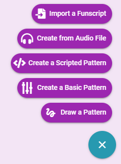

# Audio Pattern

Patterns can be created from any audio files you have that have been designed for e-stim audio based devices.

::: warning Non E-Stim Devices
The audio pattern functionality is only designed for e-stim audio files. It is not designed for having your toys react to regular music audio files. If you wish to have your toys react to playing music then use the [System Audio](introduction/basic-functionality.html#e-stim-audio) built-in pattern.
:::

To create a pattern navigate to **My Patterns**, click the **+** button and select **Import a Funscript**.

Select your audio file, give your pattern a name, and Save.

