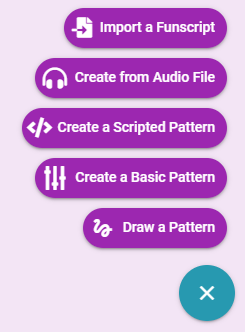
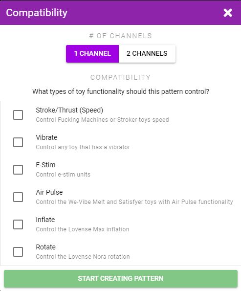
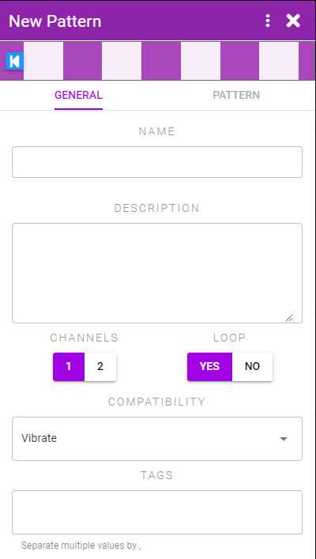
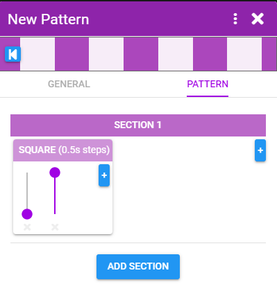
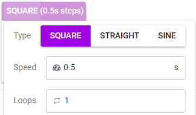
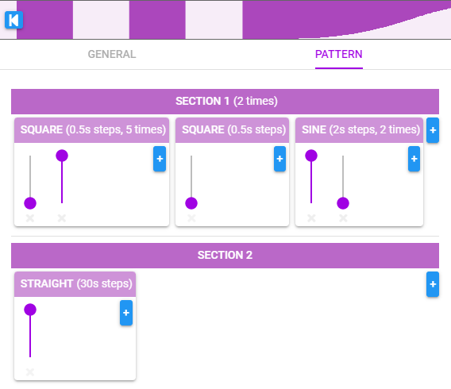

# Basic Pattern

Basic patterns are created by setting a number of sliders and telling XToys how long to spend going from the value of one slider to the next.

To create a pattern navigate to **My Patterns**, click the **+** button and select **Create a Basic Pattern**.

Select what types of toys you want the pattern to be compatible with.

::: tip Compatibility
Your compatibility selection does not change anything in terms of pattern creation. It only limits which toys your pattern will be playable on. Select compatibility types that make sense for the pattern you are creating.

Example: Inflate and Rotate work best with patterns that change in slow blocky steps, whereas Vibrate and E-Stim can work well with continually changing sine-wave type patterns.
:::

## General Tab

In this tab you can set:

* **Channels** - The number of channels (ie. how many different toy parts this pattern will control)
* **Loop** - Whether the pattern should repeat once it gets to the end
* **Tags** - Add tags so you can later search all your patterns by your tags

## Pattern Tab

In this tab you create your pattern. Patterns are composed of multiple blocks inside multiple sections.

Each block contains as many sliders as you want. The pattern will transition from the value of one slider to the next. Click the **+** buttons to add a new slider, block, or section.

By clicking on the block header (SQUARE in this case) you can control how the sliders are interpreted.

* **Type** - The pattern can either jump from one value to the next (Square), linearly move to the next value (Straight), or smoothly ramp (Sine)
* **Speed** - The time to spend transitioning to the next slider's value
* **Loops** - How many times to repeat all the values in this block before moving on to the next block

Sections can also be configured to loop if you want multiple blocks to loop.

## Example

Here's a more complex example.

* The first block triggers a basic an on/off pattern 5 times (square pattern from 0 to 100)
* The second block sets the pattern back to 0 (since it was left at 100 at the end of the first block)
* The third block does a slow sine wave ramp up to 100 over 2s and then back down over another 2s. This is repeated twice.
* The entire first section of these 3 blocks is repeated again
* Section 2 is then run and the pattern slowly ramps from 0 (from the end of the sine wave block) up to 100 over 30s

The pattern then loops back from the beginning.