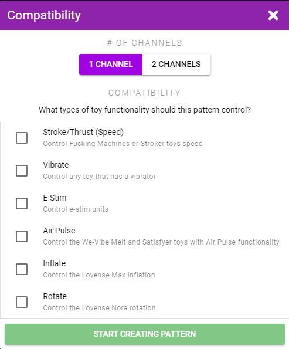

# Drawn Pattern

Drawn patterns are created by drawing a pattern with your mouse or finger.

To create a pattern navigate to **My Patterns**, click the **+** button and select **Draw a Pattern**.

Select what types of toys you want the pattern to be compatible with.

::: tip Compatibility
Your compatibility selection does not change anything in terms of pattern creation. It only limits which toys your pattern will be playable on. Select compatibility types that make sense for the pattern you are creating.

Example: Inflate and Rotate work best with patterns that change in slow blocky steps, whereas Vibrate and E-Stim can work well with continually changing sine-wave type patterns.
:::

## General Tab

In this tab you can set:

* **Channels** - The number of channels (ie. how many different toy parts this pattern will control)
* **Loop** - Whether the pattern should repeat once it gets to the end
* **Tags** - Add tags so you can later search all your patterns by your tags

## Draw Tab

In this tab you create your pattern. Click on one of the number circles and drag it up or down to draw your pattern (left or right motion doesn't do anything). The pattern will be displayed in the top graph. Re-selecting the same circle will reset the pattern for that channel.

If you want to draw a fast changing pattern but can't move your mouse/finger quick enough you can decrease the **Recording Speed** slider.

## Data Tab

This tab has the raw positions that were recorded while you drew your pattern (in Funscript format). If desired you can manually edit your data points.