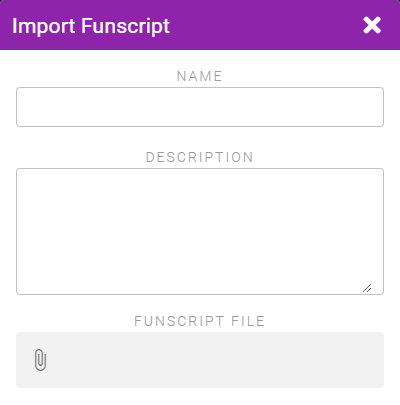

# Funscript Pattern

Patterns can be created from any .funscript files you may have. For more info about the Funscript format see the [Funscript page on STPIHKAL](https://stpihkal.docs.buttplug.io/video-encoding-formats/funscript.html).

To create a pattern navigate to **My Patterns**, click the **+** button and select **Import a Funscript**.

Select your .funscript file, give your pattern a name, and Save.

::: warning Toys Other than Strokers
Note that by default the Funscript will have its compatibility set to Stroke/Thrust toys only as that is the main use case for .funscript files. If instead you do want your Funscript pattern to be usable by other toys like vibrators then edit the pattern after creating it and edit the Compatibility section to include the other toy types.
:::