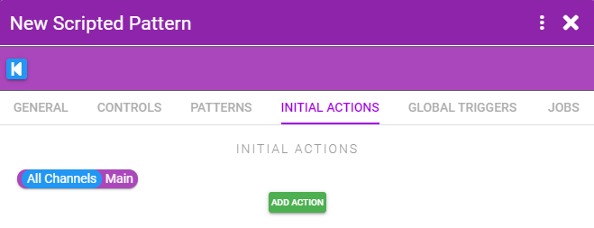

# Scripted Pattern

Scripted patterns are similar to Basic Patterns in that the pattern is created by setting a number of sliders and telling XToys how long to spend going from the value of one slider to the next. However unlike Basic Patterns you can also dynamically change the pattern. You can add controls to the pattern or have some scripts adjust the values in the pattern or even what pattern is playing.

To create a pattern navigate to **My Patterns**, click the **+** button and select **Create a Scripted Pattern**.

Select what types of toys you want the pattern to be compatible with.

::: tip Compatibility
Your compatibility selection does not change anything in terms of pattern creation. It only limits which toys your pattern will be playable on. Select compatibility types that make sense for the pattern you are creating.

Example: Inflate and Rotate work best with patterns that change in slow blocky steps, whereas Vibrate and E-Stim can work well with continually changing sine-wave type patterns.
:::

## General Tab

In this tab you can set:

* **Channels** - The number of channels (ie. how many different toy parts this pattern will control)
* **Tags** - Add tags so you can later search all your patterns by your tags

## Patterns Tab

In this tab you create your pattern. Patterns are composed of multiple blocks inside multiple sections. You can have multiple patterns defined and then have an action change which pattern is active. By default there is one pattern defined called **Main** and an **Initial Action** which triggers it to play.

Click on the **Main** pattern to go to the pattern editor.

Each block contains as many sliders as you want. The pattern will transition from the value of one slider to the next. Click the **+** buttons to add a new slider, block, or section.

Click the cursor icon under the slider to input a custom value. The custom value can be an XToys variable (in the form **{varname}**).

By clicking on the block header (SINE in this case) you can control how the sliders are interpreted and define actions to run at the end of the block.

* **Type** - The pattern can either jump from one value to the next (Square), linearly move to the next value (Straight), or smoothly ramp (Sine)
* **Step Size** - The time to spend transitioning to the next slider's value
* **Loops** - How many times to repeat all the values in this block before moving on to the next block
* **Scale** - A percentage amount to scale all values in this block by (ex. make all values be treated as 50% of whatever the value actually is)
* **After Each Loop** - Make a variable change value each time a loop of the block finishes
* **At End of Block** - Make a variable change value after all loops of this block finish

Sections can also be configured with similar settings.

::: tip Dynamic Values
You can enter an XToys variable for the value of Step Size, Loops, and Scale to have those values be dynamic. This is especially useful in combination with a Control to let the user adjust the pattern speed/step size to their liking.
:::

## Controls

Controls allow you to display sliders and input boxes that can be used to dynamically change XToys variables while the script is running.

## Initial Actions

Initial Actions are actions that are triggered immediately when the overall pattern is started. This includes setting which sub-pattern should be running, setting initial variable values, or starting a Job.

## Global Triggers

Global Triggers allow you to trigger Actions in response to the current state of the pattern. You can set a trigger for when the current sub-pattern has finished, or when a variable reaches a certain value.

In the example above we're resetting the {height} back to 0 whenever it gets above 100 (and then we could have the pattern slowly increase in height each loop and it will get reset back to 0 if it gets too high).

## Jobs

Jobs allow you to run a sort of state engine and have Actions fire or Triggers be active based on the current state.

* Jobs are composed of a number of Steps
* A Job can only be in one Step at a time
* When a Step starts the Actions for that Step are immediately run
* Triggers will only fire if they're part of the current Step
* Multiple Jobs can be active at the same time
* The **START** Step will always be the first Step that is triggered when a Job is started

## Example 1 - Variables

Here's a basic example of using variables in the pattern.

  
The pattern is set to make a sine wave from from 0 to {height}.

  
Step size is set to 2s to make a slow sine wave, and {height} is set to be randomly set to either 20, 40, 60, 80, 100 every time the block is run.

  
{height} is set to also be randomly either 20, 40, 60, 80, or 100 when the pattern is started.

  
The pattern now makes waves of random heights.

## Example 2 - Controls

Here's a basic example of using controls.

  
A speed slider that allows the user to set the speed between 0.2 and 2.

  
The pattern step size is set to the value of that speed slider.

  
When you select the pattern to run on your toy you'll see the speed control and  can adjust it to change the speed of the pattern.

## Example 3 - Jobs

Instead of having a manual slider for changing the speed like in Example 2, we could instead randomly change the speed every 5s by using a Job.

  
The speed will be set to a random value when the Job is started, and every 5 seconds the same START step will be restarted (thus causing the Action to re-run and a new random speed to be chosen).

  
The Job doesn't run by default so we also add an Initial Action to start it.