# Example 1 - Auto Increase

**Goal:** Make the toy slowly increase in intensity. Allow user to choose how fast it increases.

#### Step 1
First we'll want to set up the block connections. Our script will just connect to a single generic toy.

Under the General tab add a Generic Output connection.

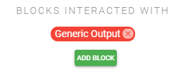

#### Step 2
Next we want to add a slider that our users can use to adjust how fast the toy increases in intensity.  

Under the Controls tab add a timing slider control.

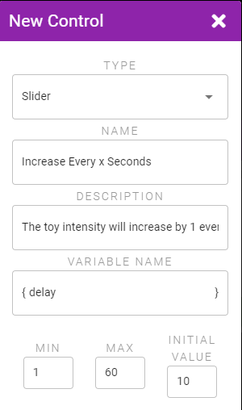

#### Step 3
We want to use a Job to perform the slow increase and by default the Script is already set up to start a Job. However we also want to have the toy start at 0% intensity. So add an additional Action that sets the toy to 0% and then drag it above the existing Job start Action so it runs first before the Job is started.  

Under the Start/Stop Actions tab add a new Initial Action that sets the toy to 0%.

::: image-grid
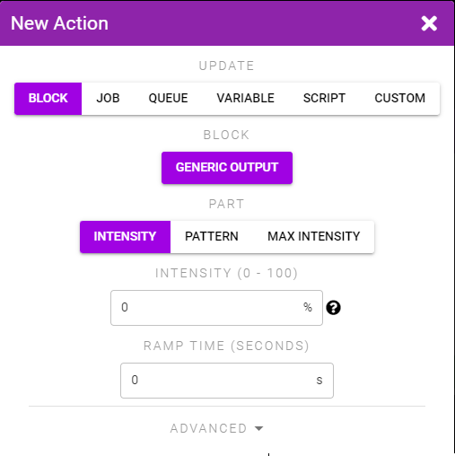  
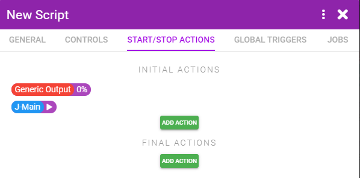
:::

#### Step 4
We want to know the current intensity so we can stop increasing once we've hit 100%. We'll store the intensity in a variable we can use later.

Under the Global Triggers tab add a new Trigger that logs the current intensity to a variable.

::: image-grid
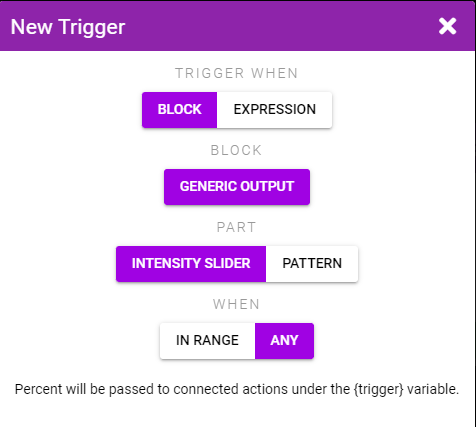  
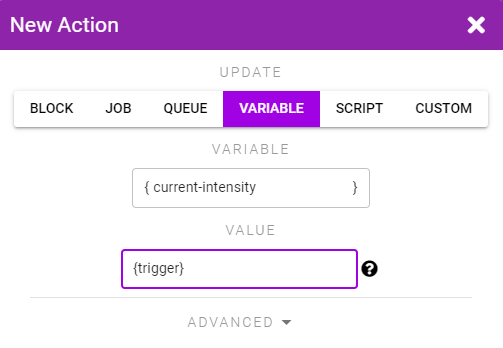  
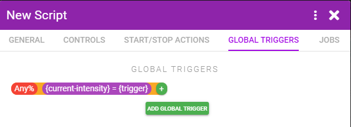
:::

::: tip {trigger} Variable Lifetime
The Intensity Slider Trigger (and most Triggers that output a value) dump the value into a {trigger} variable. This variable is only defined for Actions that are connected to the Trigger. We therefore take the {trigger} variable and store it into a more permanent variable that we're caling {current-intensity}.
:::

#### Step 5
We want the toy to increase intensity by 1%, and then wait for however long the user chose, and then repeat. We should also make the increase Action not run if the intensity is already over 100%.

Add an Action to the first Step that increases the toy intensity by 1%. Make it only run if the toy intensity is below 100 (ie. **{current-intensity} < 100**)

Add a Trigger to the first Step that waits **{delay}** seconds (the variable we defined in step 2).

Add an Action to the Trigger that re-runs the current step so that the Step will continually restart every **{{delay}}** seconds.

::: image-grid
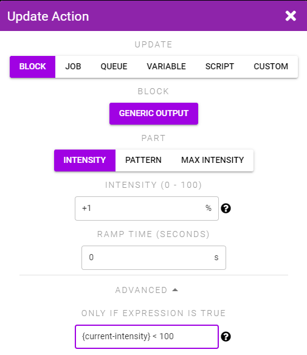  
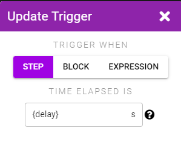  
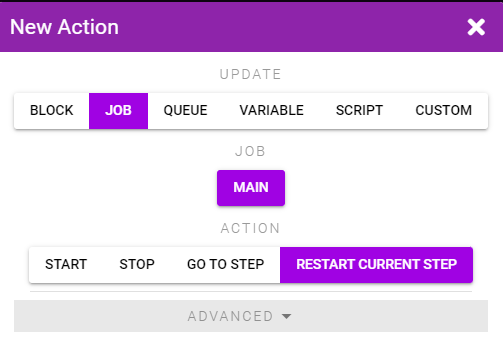  
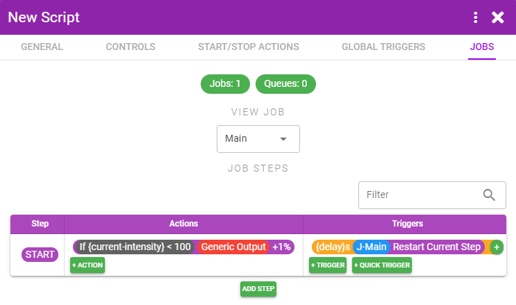
:::

#### Step 6
Save your Script, add it to your session, connect it to a toy, and start it. You should see the toy slowly increase in intensity.

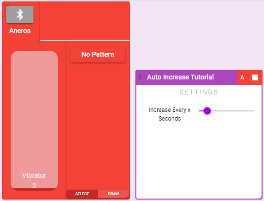
