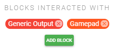
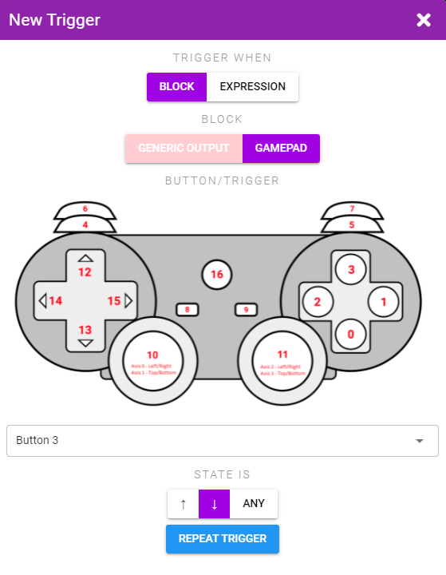
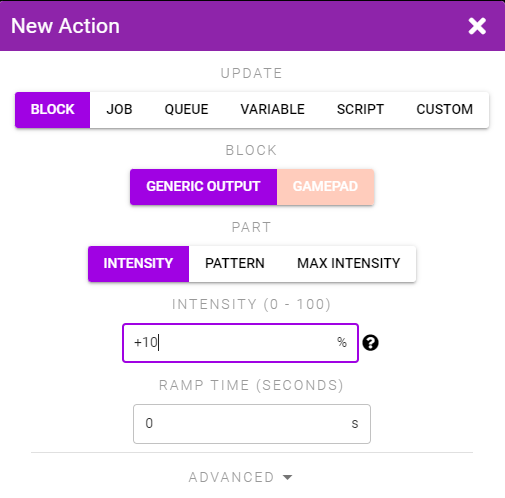
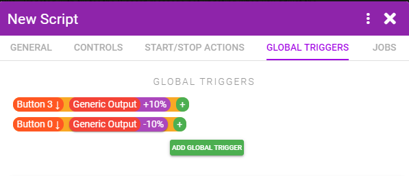
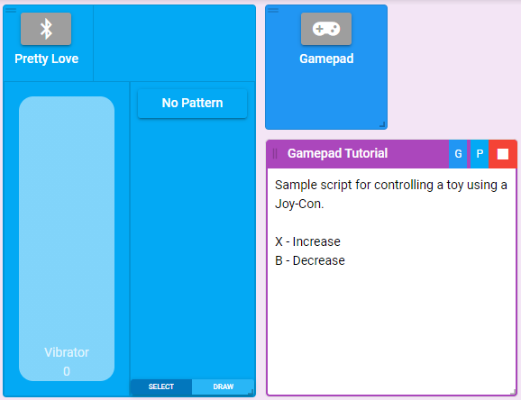

# Example 2 - Gamepad Controls

**Goal:** Make it so you can control your toy with a gamepad. We'll make pressing X on a Joy-Con increase the intensity, and B decrease.

#### Step 1
First we'll want to set up the block connections. Our script will connect to a single generic toy and a Gamepad.

Under the General tab add a Generic Output connection and a Gamepad connection.

#### Step 2
Under the Global Triggers tab add a new Trigger that fires when the X button is pressed down (ie. button 3). Add an Action to the Trigger that increases the intensity by +10%.

Do the same for the B button (ie. button 0) but with a -10% decrease.

::: image-grid
  
  

:::

#### Step 3
Save your Script, add it to your session, connect it to a toy and a Gamepad, and start it. Connect your Joy-Con, press X or B and you should see the toy move up or down in intensity.

::: tip Enhancement Ideas
Make it so you the intensity slowly increases/decreases while the button is held (either by setting the Repeat Trigger value in the Trigger, or by using a Job that you start or stop depending on the button state).

Make an additional button jump the intensity immediately to 100%, or to 0% to quickly turn off the toy.

Make different buttons toggle different patterns.
:::