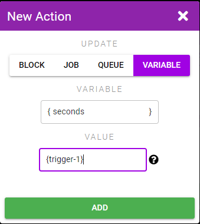
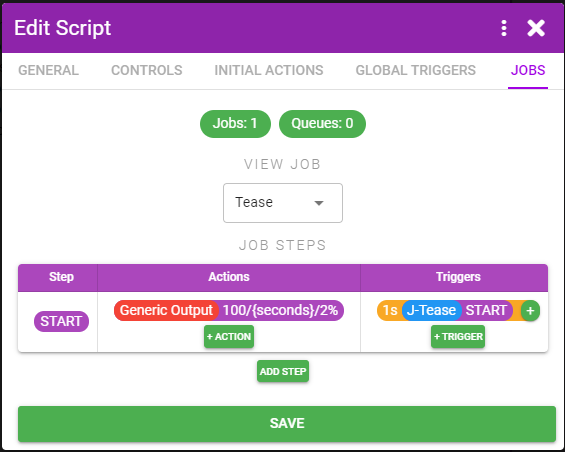

# Example 3 - Virtual Assistant

**Goal:** Create a script that reacts to custom voice commands. For this script we'll create a virtual assistant that will listen to our commands and speak back that they're doing the task we requested.

Commands:
* **stop** - Stop the toy immediately
* **set speed to (slow|medium|fast)** - Set the toy to a certain speed
* **tease them for x seconds** - Slowly ramp up and then ramp down over the requested number of seconds

#### Step 1
On the **General** tab under the **Blocks Interacted With** area click **Add Block** and add three Blocks:
* **Speech Recognition** - The block we'll use for listening to commands we say
* **Text to Speech** - The block we'll use for having the bot talk back to us
* **Generic Output** - A basic block that can output a command to any sex toy

#### Step 2
On the **Jobs** tab click the **Jobs** button, **+ New Job**, name the job Tease, and click **Update**. We'll use this job for when the tease command is kicked off.

#### Step 3
On the **Global Triggers** tab click **Add Global Trigger**. Select **Block**, **Speech Recognition**, and enter the first command stop. Repeat for each of the other two commands. Skip punctuation as the speech recognition doesn't use it.

For the tease command use the phrase **[a-z]* for ([0-9]\*) seconds**. [a-z]* is a regex matching any word ([0-9]*) is a regex matching any number. You don't need to know or understand what a regex is, just know that it matches any single word or number respectively. And by wrapping it in () brackets it will allow the portion in the brackets to populate the {trigger-1} variable and for us to use the value in our Actions that we'll soon set up. The speech recognition being used by XToys filters out nsfw words and thus instead of listening for the word tease we're just going to trigger on any word that fits the pattern of "word for x seconds".

#### Step 4
Click the **+** button beside the "stop" trigger to add an Action that will trigger when the command is said. Select **Block**, **Generic Output**, **Intensity**, and enter **0** for the intensity. Click **Add**. Now whenever you say "stop" the connected toys will turn off.

#### Step 5
Click the **+** button beside the "speed to" trigger to add an Action that will trigger when that command is said. Select **Block**, **Generic Output**, **Intensity**, and enter **{trigger-1} == 'slow' ? 33 : {trigger-1} == 'medium' ? 66 : 100** for the intensity. Click **Add**.

Again we're getting in to some programming lingo. Basically if the command contained the word "slow" then we'll set the intensity to 33%, if it was "medium" we'll set it to 66% and otherwise (ie. "fast" was said) we'll set it to 100%.

#### Step 6
Click the **+** button beside the "for x seconds" trigger to add an Action that will trigger when that command is said. We want to keep track of how many seconds you said so we'll grab that value from {trigger-1} and store it in a different {seconds} variable (since trigger- variables only exist during the Actions connected to the Trigger).

Select **Variable**, enter **seconds** for the variable name, and **{trigger-1}** for the value. Click **Add**.
Click the **+** button again and select **Job**, **Tease**, **Start**. Click **Add**.

Since we want this Trigger to do multiple things we're going to have it start a Job that will perform the desired actions (increase toy speed and then decrease it).

#### Step 7
Under the **Jobs** tab click **+ Action** in the **START** row. The START step is the step that becomes active when a Job is started. We want to increase the speed over the span of half the requested number of seconds. So for example if we said "tease for 10 seconds" it should ramp up to 100% over 5 seconds, and then decrease over 5 seconds. And would thus need to increase by 20% per second. In other words it needs to increase by 100/seconds/2 every second. Hurray math!

Select **Block**, **Generic Output**, **Intensity**, and enter **100/{seconds}/2**.

#### Step 8
After 1 second has passed we want to re-run that Action. We can do so by having the Job re-run the START step. Click **+ Trigger**, select **Step**, and enter **1** for the Time Elapsed. Click **Add**. Click the **+** beside the 1s Trigger we just created and select **Job**, **Tease**, **Go to Step**, and enter **START**. Click **Add**.

The actions in the START step will now re-run every second.

#### Step 9
Once the toy has reached 100% intensity we want to stop repeating the START step and switch to a new step that will lower the intensity every second until we're back to 0.

Click the **Add Step** button, name the new step **Ramp Down** and click **Add**.

We want to go to this step when the toy hits 100% intensity so click **+ Trigger** on the START step, **Block**, **Generic Output**, **Intensity**, **In Range**, and enter **100** for the min and max.
Add an Action to this Trigger to go to the Ramp Down step.

#### Step 10
Instead of having the decrease Action run immediately we'll instead put it behind the 1s time elapsed Trigger. This will allow us to see that we can have multiple Actions run from a Trigger, and also it will allow the intensity to sit at 100% for 1s instead of immediately dropping.

Click **+ Trigger** on the RampDown Step. Create a 1s Time Elapsed Trigger just like before.

Click the **+** button beside the 1s Trigger and create a Intensity change Action that is the same as before but we're now subtracting instead **{value}-100/{seconds}*2**. Also create an Action to repeat the RampDown job just like before.

#### Step 11
Create a new Trigger for when the intensity is back at 0%. When it is we want to stop this Tease Job (**New Action**, **Job**, **Tease**, **Stop**).

#### Step 12
Everything should work now for the 3 commands and you can test it to confirm. Before we're finished there's a couple other improvements we should make.

First we're not actually using the Text to Speech Block yet. So let's add speech actions to each of the Triggers, as well as after the Tease Job is complete.

#### Step 13
And lastly we should make the stop and (slow|medium|fast) Triggers stop the Tease job if it's already running since the Tease Job attempting to adjust the toy intensity will conflict with us trying to set it to a steady intensity.

#### Step 14
We're finally done. Save the Script and test it.