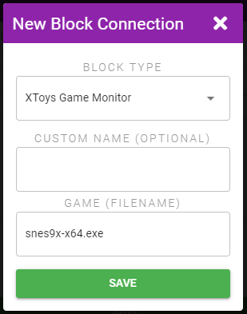
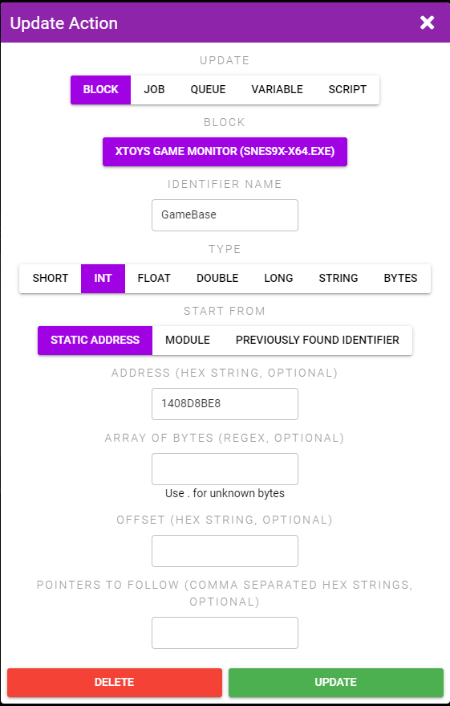
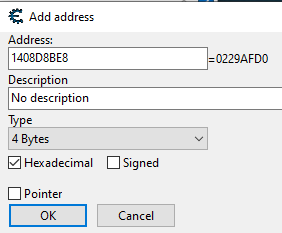
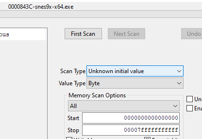
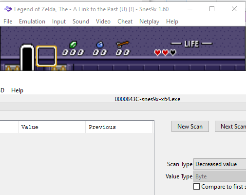
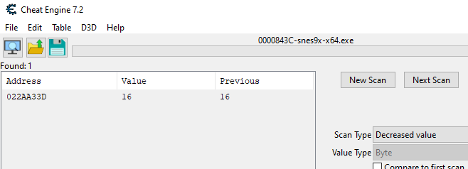
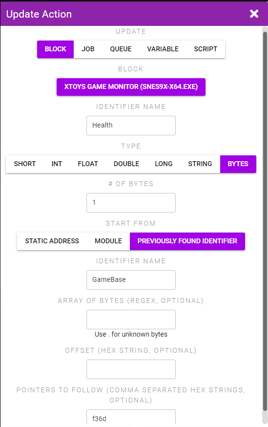
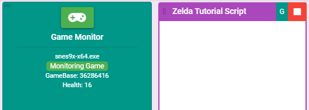
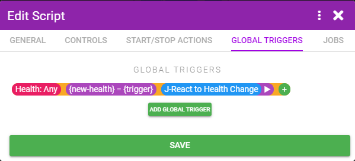
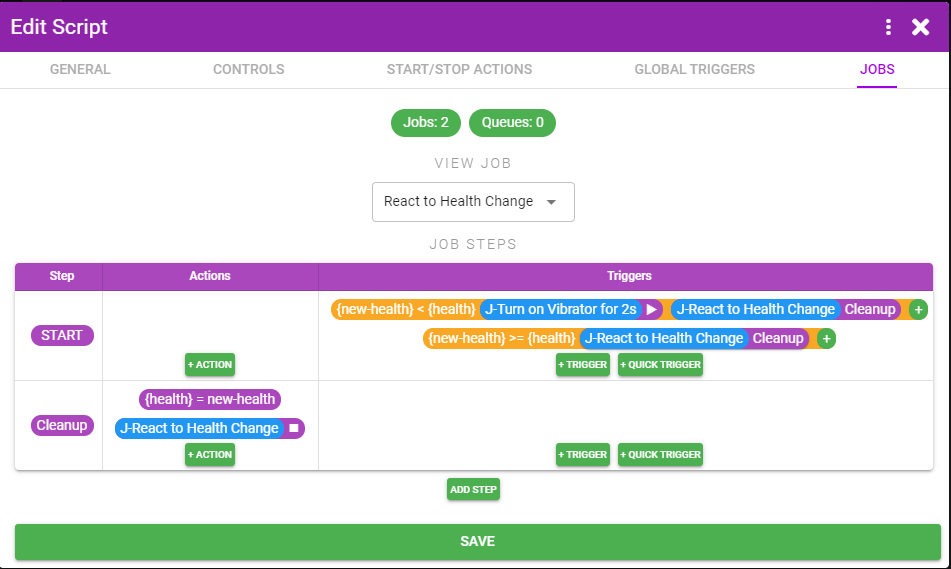

# Example 4 - Process Monitor

Process Monitor monitors memory addresses in games so XToys can react to them. To find these memory addresses you'll need to understand some assembly and how to find these addresses.

[Cheat Engine](https://cheatengine.org/) is a very useful software title for finding memory addresses so familiarize yourself with Cheat Engine first and follow their [tutorials](https://wiki.cheatengine.org/index.php?title=Tutorials:Cheat_Engine_Tutorial_Guide_x64).

**Goal:** For this script we'll connect to the Link to the Past rom running in Snes9x and have our script vibrate the toy any time we lose health.

**Requirements:**

* Snes9x v1.60 (x64)
* Link to the Past rom
* Cheat Engine software

#### Step 1
In XToys add the Process Monitor connector to a new script. Put in the emulator exe name.

#### Step 2
Add an Initial Action that creates an Identifier for the base address for your emulator that points to the start of the SNES game memory. Finding this address is outside of the scope of this guide, but valid values for a variety of emulators and versions can be found in various locations like on [Github](https://raw.githubusercontent.com/Spiraster/ASLScripts/master/LiveSplit.SMW/LiveSplit.SMW.asl).

We're using Snes9x 1.60 (x64) so create an Identifier for the static address 0x1408D8BE8 and call it 'GameBase'.

You would not need this value if using Process Monitor with a Windows game.

#### Step 3
Open Snes9x and start Zelda, open Cheat Engine, connect Cheat Engine to the Snes9x process.

#### Step 4
Click Add Address Manually, enter 0x1408D8BE8 for the address and click the Hexidecimal checkbox. Note down the result for use later (0x0229AFD0 in my case). This is the starting address for the Zelda game data and will change each time you restart Snes9x. But since we're always having XToys start from 0x1408D8BE8 it will always point to the correct memory location.

#### Step 5
Start a New Scan. We don't know how Zelda is storing health data.

It might be 3 when you have 3 hearts. And it might be an Int type. So you could try that...but it'd be wrong and I don't feel like writing up those wrong attempts so I'll just tell you health is stored in a single Byte.

So we'll set the Value Type to Byte, and Scan Type to Unknown Initial Value. Click First Scan.

#### Step 6
Go get hit by an enemy and then set the Scan Type to Decreased value and click Next Scan.

#### Step 7
Keep doing that until you only have 1 value in the list of addresses left. If you die you can change Scan Type to Increased Value and then back to Decreased Value.

#### Step 8
We did it! Looks like your health is actually stored as the number of displayed half hearts * 4. When at 3 hearts your health is 24.

#### Step 9
The address is my case is 0x022AA33D. Do some quick math to find the difference between this value and the start value you wrote down in step 4. 0x022AA33D - 0x0229AFD0 = 0xF36D. Cool, so your health value is always stored 0xF36D away from the address pointed to by 'GameBase'.

#### Step 10
Back in XToys create a new Initial Action that create a Health Identifier. It's a single byte, starts at the result from the GameBase Identifier, and has an F36D pointer.

#### Step 11
Save the Script and run it. You should see your health displayed in XToys. Get hit and confirm it updates correctly.

#### Step 12
And now you can use that value in a Trigger however you want. Turn on a vibrator/estim depending on how much health you have, or whenever you health goes down, or whatever other ideas you have.

For example you can store the health value and then start a Job that checks if the new health is less than what it was previously. If it was start a Job to turn on the vibrator for a bit. And then update the current health.

