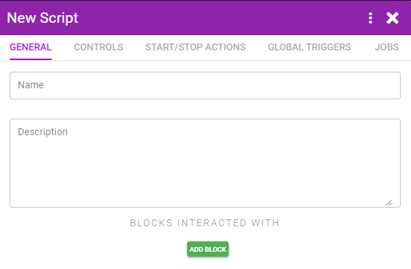
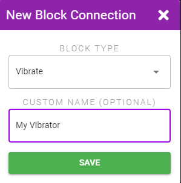
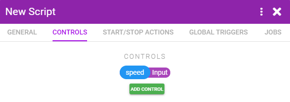
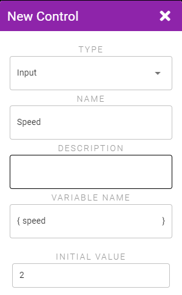
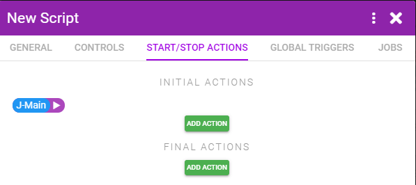
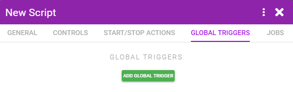
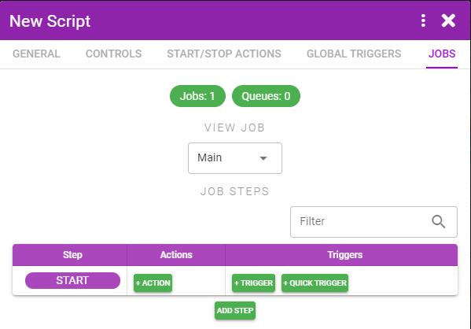

# Script Creation Overview

Scripts are used for automating your toys and defining how your toys should react to events that happen in any Tools you have connected.

::: tip Embedding
If your script is only designed for connecting to a single Tool then it can be embedded in the Tool and the Tool + Script will show up as a single block in XToys. If the Scripts connects to multiple different Tools then the Script will always be added as a standalone block that can be manually turned on and off.
:::

To create a Script navigate to [My Scripts](https://xtoys.app/me/scripts) and click the + button.

## General Tab

In this tab you must select which blocks this Script will control/interact with. In general you'll likely be adding a Tool and a type of Toy.

Click **Add Block**, select the type of block, and optionally give it a user friendly name that will be shown instead of the default name.

## Controls Tab

Controls allow you to display sliders, input boxes, dropdowns and other controls that can be used to dynamically change XToys variables while the script is running.

## Start/Stop Actions Tab

Initial Actions are actions that are triggered immediately when the script is started. This generally is used for things like setting initial variable values, starting a Job, or setting the connected toys to the desired initial intensity or pattern.

Final Actions are actions that are triggered when the script is stopped. This is generally used for setting the toy intensity back to 0.

## Global Triggers Tab

Global Triggers allow you to trigger Actions in response to the current state of the script or connected blocks. These triggers will always be active through the entire run of the script. If you want triggers to only be active are certain points then use Triggers within a Job instead.

## Jobs Tab

Jobs allow you to run a sort of state engine and have Actions fire or Triggers be active based on the current state.
