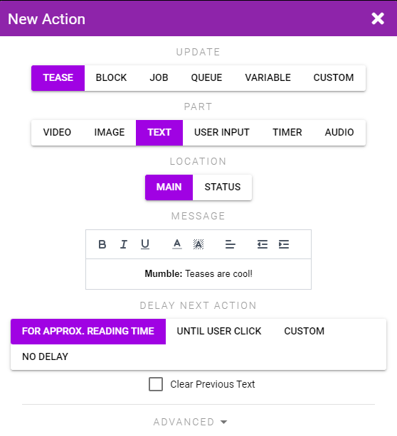

# Tease Creation Overview

Teases are very similar to Scripts and the Tease creator is largely the same as the one for Scripts. Therefor this section will only cover the parts that are different.

Teases are designed to show images, video, audio, and buttons to the user while also controlling their toys.

To create a Tease navigate to [My Teases](https://xtoys.app/me/teases) and click the + button and select **Create from Scratch**.

If you have a Pornhub video and matching Funscript you can also generate a Tease that plays the video and Funscript in sync by selecting the **Create from Funscript + Pornhub Video** option.

## General Tab

The General tab includes an extra option for setting a cover photo for the Tease. The cover photo will be displayed in the list of Teases, when the Tease is not yet running, and as the default image if no other image/video is being shown.

## Media Tab

The Media tab allows you to upload images and audio, link to Pornhub videos, and choose patterns. If you want the user to select their own local Funscript or video file you can also do so from this tab.

The names you give your media here can be referenced in Actions.

::: tip Randomization
If you want to display random images you can upload multiple images and name them for example cute-1, cute-2, cute-3 and make XToys choose a random one to display by using **cute-(1-3)** as the expression when setting the current image.
:::

## Tease Actions

Teases have a number of Actions that are specific to Teases.

* **Video** - Display a video (either one you created in the Media tab or one from a Pornhub ID)
* **Image** - Display an image (either one you uploaded in the Media tab or one pulled at random from a Reddit subreddit you choose)
* **Text** - Display a message either in the Main text area (as a speech bubble), or in the Status bar which is a one line area between the video/image and the Main text area. Text can have some simple formatting and color applied, and you can choose how long to display the text before going on to the next action.
* **User Input** - Allows you to display a choice to the user. Either a text field, or a set of button choices. Their selection will be stored in an XToys variable. You can also display buttons on the side of the Tease which will stay throughout the Tease.
* **Timer** - Displays a countdown timer in the Tease which can be configured to either set an XToys variable or jump the Tease to a new step when the timer ends.
* **Audio** - Play an audio file you uploaded from the Media tab.

::: warning Action Processing
Note that Text, Timers, and User Input Actions are blocking Actions. The next Action will not trigger until the text delay has passed/the user has made their selection.

You can thus create a chain of Actions within a single Step that displays a message, adjusts the toy, displays a message, adjusts the toy, etc.
:::