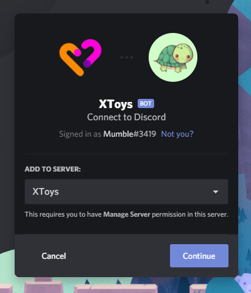

# Discord Bot

## Setting Up the Bot

The XToys Discord Bot allows you to have your toys react to messages and reactions that happen in a Discord channel.

The Discord bot has 4 ways of reacting to Discord events:
* **Listen for Keyword** - Trigger anytime someone says a certain keyword anywhere in their message
* **Listen for Reaction (My Posts)** - Trigger anytime someone reacts with a specific reaction on any of your messages
* **Listen for Reaction (Bot Post)** - Trigger anytime someone reactions with a specific reaction to the XToys Bot post that gets created when you connect to the bot
* **Listen for Command** - Trigger anytime someone starts a message with a specific keyword. The command can include additional arguments to customize the trigger action.

1. If you don't already have the XToys Bot in your Guild, click [here](https://discord.com/api/oauth2/authorize?client_id=769208067857973298&permissions=537226304&scope=bot) to add the bot.

2. In Discord send the message **.xtoys register** in your Guild. It will respond with your Guild ID.

3. Go to your [XToys Profile](https://xtoys.app/me) and enter your Guild ID under the Discord section. Click Save. If you do not have a Premium XToys Membership this area will instead have steps on how to sign up for a Premium membership via Patreon or Paypal.

## Using the Bot

1. Add your desired toy, the Discord Bot tool, and a Script that uses the Discord Bot. Connect the Script to the toy and Discord Bot.

2. Click the Discord Bot connect button. It will display a command to send in Discord. Enter the command in the Discord channel. The bot will respond saying it's connected.

3. Start the script. The bot's message will update to show what commands are active as a result of the script.

4. Do the action in the Discord channel and your toy should react as scripted.

## Additional Notes

* The Discord bot has some additional commands that a Guild owner can run to configure it. These settings can only be changed if the Guild has been registered.
    * **xtoys settings keywordreactions {on/off}** - Toggle whether the bot should react with a purple heart when it detects a keyword to react to
    * **.xtoys settings commandreactions {on/off}** - Toggle whether the bot should react with a purple heart when it detects a command to react to
    * **.xtoys settings botpostreactions {on/off}** - Toggle whether the bot should put initial reactions for each reaction that it will react to on its bot post
    * **.xtoys settings userlimit {number}** - Set the maximum number of users that can be connected to the bot from a single channel
* **.xtoys help** will display info on how to use XToys and connect to the bot for new users.
* If people are tagged in a message than the XToys Bot will only react to those people
* The bot will only work in channels marked NSFW
* Remove View Channel permission for the bot in any channels you don't want it active in
* The bot will only update a post at most every 5s (for unregistered Guilds it will update much slower)
* If the bot is under heavy usage in a channel its updates may be delayed
* The bot will respond to messages in the channel it was connected from, or any threads in that channel
* If connected to from a private thread then it will only respond to messages in that private thread

## Script Developer Notes

* To use the bot you must both send an Action to the bot and also set up a Trigger with the exact same keyword/command/reaction
* Any matched groups in an XToys Bot command will be passed to connected actions. Ex. If the command is **vibrate {intensity}** and someone uses the command **vibrate 50** then the variable {trigger-intensity} will contain the number 50
* If you have variables that adjust the bot Actions ensure you recall the Action as the bot will not automatically updateb