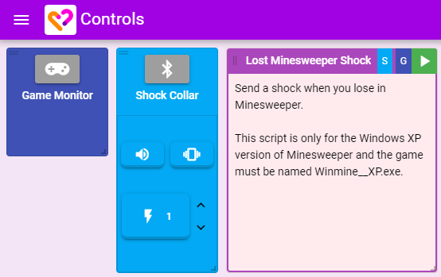
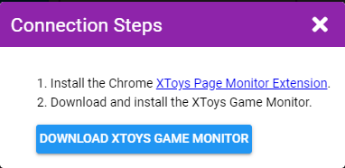
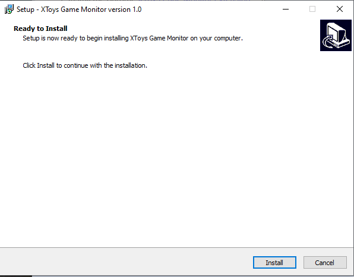
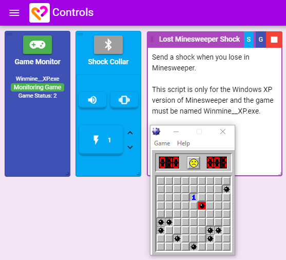
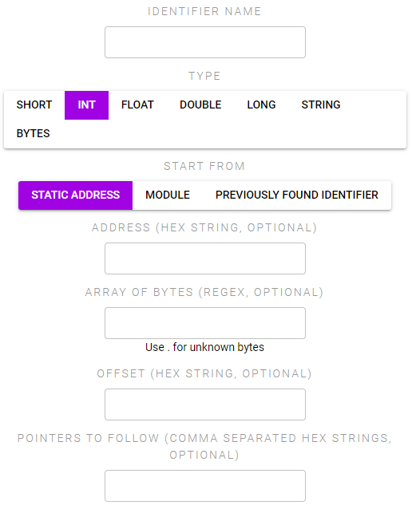

# Process Monitor

## Setting Up

The XToys Process Monitor allows you to have your toys react to events that happen within Windows games or other Windows apps.

1. Add your desired toy, a Process Monitor tool, and a Script that uses the Process Monitor. Connect the Script to the toy and Process Monitor.

2. Click the Process Monitor connect button and follow the directions to install both the Chrome extension and the Process Monitor software.

3. Start the game the script was designed for and ensure the game shows up as being connected in the Process Monitor block. Your actions in the game should now trigger your toys.

## Additional Notes

* Process Monitor may be blocked or deleted by your Antivirus. Whitelist the Process Monitor installer and files to allow Process Monitor to function
* Instead of using the Process Monitor installer you can instead download the source Python files and use them instead. Instructions and files are on [Github](https://github.com/denialtek/xtoys-game-monitor)
* The game exe must exactly match the game name listed in the script
* Process Monitor scripts are in many cases version specific and will only work with a certain version of the game
* Process Monitor is for Windows games only
* Process Monitor may trigger anti-cheat detection in games. We don't recommend running Process Monitor on online games or games that use Valve Anti-Cheat detection

## Script Developer Notes

* For an example of creating a Process Monitor script check the [Process Monitor script example](http://localhost:8081/script-creation/example-4.html).
* Actions must be configured to tell Process Monitor to monitor each memory address, and then a Trigger can be created to react to changes from that address
* Identifiers are evaluated in the order the Actions are defined, so if an identifier starts from the address of a different identifier ensure that previous identifier is defined first
* Array of Bytes uses a . to identify any bytes (instead of question marks like in Cheat Engine)
* Refer to [Cheat Engine tutorials](https://wiki.cheatengine.org/index.php?title=Tutorials:Cheat_Engine_Tutorial_Guide_x64) to get an overview of how to find memory addresses for games
* Array of Bytes, Offset, and Pointers array are all optional for any given identifier. If multiple are given they are evaluated in the listed order.
* Memory addresses may already have been found for the game you want to use with XToys. Check [LiveSplit AutoSplitters](https://github.com/LiveSplit/LiveSplit.AutoSplitters), or search online for a 'Cheat Table' for your game

### Available Actions

Process Monitor has a single action which is to request to read and monitor a specific memory address.

You can start locating the address from:
* Static Address - a hex string of the memory address
* Module - enter the exe name or the name of another module that Cheat Engine detected within the application to start from the memory address of the app/that module
* Previously Found Identifier - enter the name of an identifier you defined in an early Process Monitor action

Starting from that address you can then find the correct address via one or more of the following (each will be executed in the order listed):
* Array of Bytes - locate an array of bytes within the process (use . for unknown bytes)
* Offset - from the address found so far, offset by the given amount
* Pointers - enter a comma separate list of hex values to follow

While running Process Monitor will display the value it found at the final memory address.

### Available Triggers

Process Monitor can trigger based on the value it reads from the previously called actions. The address will continually be checked for changes to the value so there is not need to recall the action to update the value.