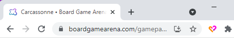

# Webpage Monitor

## Setting Up

1. Click the Webpage Monitor connect button and follow the directions to install the Chrome extension.

2. After installing the extension click the Webpage Monitor connect button again and confirm the icon now turns green.

3. Add, connect, and start a Webpage Monitor script.

4. Open a tab for the relevant website and click the XToys extension icon in the toolbar. Ensure it lights up and on the XToys webpage ensure that the website is now shown as a connected site.

5. Peform the action on the website that the Script is configured to watch for and your toy should react as scripted.

## Additional Notes

The extension needs to be reconnected to the webpage any time it loads a new page. If the page changes as part of the event you're trying to monitor then it won't be possible to monitor that event

## Script Developer Notes
When the extension is connected to the webpage jQuery is embedded in the webpage and can be called from the Chrome Developer console by changing the context in the console (the dropdown labelled 'top') to the XToys Webpage Monitor context. This can be used to test your jQuery expressions.

Any matched groups in the regex expression will be passed to connected actions under the {trigger-1}, {trigger-2}, etc variables.

### Available Actions
The extension can fill out an input text field and then submit the form it is a part of.
It can not do complex filling out of forms or other interactions with elements. This functionality was mostly built for handling submitting text to cam sites that are not yet supported by the Cam Site block.

### Available Triggers
The extension can trigger events on:
* **Node Added** - a new element that matches a given jQuery expression has been added to the HTML
* **Node Changed** - some attribute of the element that matches a given jQuery expression has changed
* **Node Removed** - an element that matches a given jQuery expression has been removed

It can then return the inner text of that element, or parts of the text by using a regex expression.

It cannot currently return specific attributes of the node.